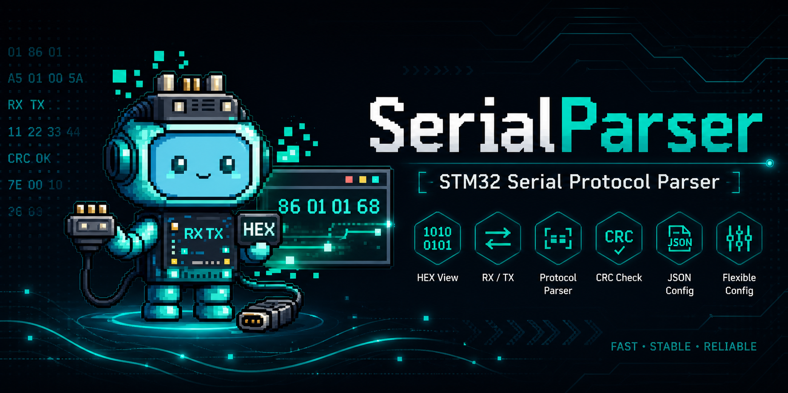

# SerialParser

SerialParser 是一个面向 STM32 调试和遥控的 Windows 串口上位机工具，基于 C++17、Qt 6 Widgets、Qt SerialPort 和 CMake 开发。

它的核心能力是“配置驱动的二进制协议解析与发送”：同一份 JSON 协议配置既可以解析 STM32 发来的数据帧，也可以生成发送给 STM32 的遥控数据帧。你可以不用改上位机代码，只通过配置文件定义包头、包尾、字段 offset、字段类型、大小端、CRC、枚举和显示范围。

## 一、拿到发布版后如何使用

如果你从 Release 下载，通常会拿到：

```text
SerialParser-Windows-x64.zip
```

使用步骤：

1. 先完整解压 `SerialParser-Windows-x64.zip`。
2. 进入解压后的 `build_release` 文件夹。
3. 双击运行 `SerialParser.exe`。

不要直接在压缩包预览窗口里双击 exe。必须先完整解压，否则 Qt DLL、平台插件、配置文件、样式文件和资源文件可能无法被程序找到。

发布目录结构：

```text
build_release
├── SerialParser.exe        # 启动器，双击这个
├── README.md               # 使用说明
└── app                     # 运行库、配置、样式和真正的 Qt 程序
    ├── SerialParserApp.exe
    ├── Qt6Core.dll
    ├── Qt6Widgets.dll
    ├── Qt6SerialPort.dll
    ├── platforms
    ├── configs
    ├── styles
    └── resources
```

如果要发给别人，推荐直接发送 `SerialParser-Windows-x64.zip`。如果已经解压，则发送整个 `build_release` 文件夹，不要只发送 `SerialParser.exe`。

## 二、快速开始

### 1. 连接串口

1. 把 STM32 或 USB 转串口设备插入电脑。
2. 打开 SerialParser。
3. 点击左侧串口区域的 `刷新`。
4. 选择对应 COM 口。
5. 设置波特率、数据位、停止位和校验位。默认配置是 `115200 / 8 / 1 / None`。
6. 点击 `打开串口`。

打开成功后，左侧状态会显示当前串口已经打开。

### 2. 选择协议配置

左侧“配置”区域用于选择当前协议配置。默认配置是：

```text
configs/remote_v1.json
```

配置下拉框显示的是用户可读的 `profileName`，真实 JSON 路径绑定在内部。切换、导入或应用新配置后，解析统计、候选帧、有效帧、错误计数和剩余 RxBuffer 会重置，避免旧数据影响当前调试。

配置管理按钮：

- `加载配置`：加载下拉框中选中的 JSON。
- `保存配置`：保存当前编辑内容；如果 `profileName` 改了，文件名会同步为 `<profileName>.json`。
- `另存为`：保存为新的 JSON 文件。
- `导入配置`：从外部选择 JSON，先校验再写入 `configs` 目录。
- `刷新配置列表`：重新扫描 `configs`。
- `打开 configs 文件夹`：打开配置目录。

### 3. 切换功能页

主界面右侧分为两个功能页：

- `接收解析数据`：查看 STM32 发来的帧、字段值、曲线和协议配置。
- `发送数据遥控`：按当前配置生成数据帧并发送给 STM32。

串口连接、配置选择、原始数据和日志区域是两个功能页共用的。

## 三、接收解析数据

进入 `接收解析数据` 页后，软件会按当前 JSON 配置解析 STM32 发来的二进制帧。

默认协议：

- 包头：`A5`
- 包尾：`5A`
- 帧长度：`20`
- 字节序：`little`
- 帧模式：`search_header`
- CRC：默认关闭

默认字段：

| 字段 | 类型 | Offset | 说明 |
|---|---:|---:|---|
| K1 | bool_uint8 | 1 | 按键状态 |
| K2 | bool_uint8 | 2 | 按键状态 |
| K3 | bool_uint8 | 3 | 按键状态 |
| LB | bool_uint8 | 4 | 按键状态 |
| RB | bool_uint8 | 5 | 按键状态 |
| Vx | float32 | 6 | X 方向速度 |
| Vy | float32 | 10 | Y 方向速度 |
| Wz | float32 | 14 | 角速度 |
| Mode | uint8 enum | 18 | 模式 |

收到有效帧后：

- “实时字段值”表会刷新字段显示值、单位和状态。
- `plot=true` 的数值字段会进入“实时曲线”。
- 底部“原始数据”会显示 RX 字节流。
- 统计栏会更新总字节数、候选帧、有效帧、帧率和各类错误。

字段异常包括字段越界、CRC 错误、包尾错误、浮点 NaN/Inf、超出字段 min/max 等。

## 四、发送数据遥控

进入 `发送数据遥控` 页后，软件会按当前 JSON 配置动态生成遥控发送控件，并把控件值打包成发送帧。

发送帧生成规则：

- 按配置写入包头和包尾。
- 按字段 `offset` 和 `type` 写入二进制值。
- 按配置 `endian` 处理多字节整数和浮点数。
- 对普通字段按 `scale` / `bias` 反算原始值：`raw = (displayValue - bias) / scale`。
- 对 `enum` 字段使用枚举 key 作为发送值。
- 对 `raw_hex` 字段直接写入输入的 HEX 字节。
- 如果启用 CRC，会在发送前自动计算并写入 CRC 字段。

字段控件规则：

- `bool_uint8` 或 `display=bool`：显示为滑动开关 UI，发送 `0` 或 `1`。
- `uint8/int8/uint16/int16`：提供输入框和滑条。滑条范围优先使用字段 `min/max`，否则使用类型范围。
- `float32/float64`：提供输入框、滑条、`下限` 和 `上限`。上下限可以在界面中直接改，滑条会按新范围映射。
- `display=enum`：显示为下拉框，选项来自 `enumMap`。
- `raw_hex`：保留 HEX 输入框，长度必须和字段 `length` 一致。
- `uint32/int32`：保留输入框，避免超大范围滑条难以精确控制。

发送操作：

1. 在左侧加载或编辑协议配置。
2. 打开串口。
3. 切换到 `发送数据遥控` 页。
4. 调整每个字段的值。
5. 查看下方 “当前发送帧 HEX 预览”。
6. 点击 `单次发送` 发送一帧。
7. 或设置 `发送频率`，点击 `开始定时发送`，再次点击可停止。

发送频率范围是 `1 Hz` 到 `1000 Hz`。频率控件支持上下箭头微调，也可以直接输入数字。

注意：float 行里的 `下限/上限` 是发送页当前控件范围，用于滑条映射和发送前检查；如果想把范围长期保存到协议配置里，请在 `接收解析数据` 页的字段配置中填写字段 `min/max` 并保存配置。

## 五、手动文本 / HEX 发送

`发送数据遥控` 页底部仍保留手动发送区，适合临时调试非结构化数据。

文本发送：

1. 选择 `文本发送`。
2. 选择编码：UTF-8、GBK / GB18030、Local8Bit 或 Latin1。
3. 输入文本。
4. 选择是否追加换行：无、`\r\n`、`\n`、`\r`。
5. 点击 `发送`。

HEX 发送：

```text
A5 01 00 5A
```

也支持：

```text
0xA5 0x01 0x00 0x5A
```

发送成功后，底部原始数据窗口会显示 `TX HEX` 或 `TX TEXT`。

## 六、原始数据和日志

底部区域在两个功能页中共用。

原始数据显示模式：

- HEX
- 文本
- HEX + 文本

示例：

```text
[12:34:56.789] RX HEX: A5 01 00 00 00 01 9A 99 05 3F 00 00 00 00 00 00 00 00 01 5A
[12:34:57.012] TX HEX: A5 00 00 00 00 00 00 00 00 00 00 00 00 00 00 00 00 00 00 5A
```

其中：

- `RX` 表示收到的数据。
- `TX` 表示发出的数据。
- 开启“显示时间戳”后，每行前面会显示 `[HH:mm:ss.zzz]`。

日志区域会显示配置加载、解析错误、串口错误、发送失败、导入失败等信息。

## 七、协议配置编辑

在 `接收解析数据` 页右侧可以编辑协议配置。

配置页包括：

- 基础配置：包长、包头、包尾、字节序、帧模式。
- CRC 配置：是否启用、类型、CRC 字段位置、计算范围。
- 字段配置：字段名、类型、offset、length、scale、bias、unit、decimals、min、max、display、enumMap、visible、plot。
- 原始数据设置：显示模式、编码、暂停显示、自动滚动、最大行数、时间戳。
- 曲线设置：时间窗口、最大点数、自动滚动、Y 轴自适应、手动 Y 轴范围。

修改后点击 `应用配置`，解析器和发送页才会使用新配置。需要长期保留时，再点击左侧 `保存配置` 或 `另存为`。

字段配置里的 `自动计算布局` 会根据包头长度、字段顺序、字段类型长度和包尾长度自动填写 offset、修正普通类型 length，并更新 `frameLength`。

## 八、默认协议说明

默认配置对应的 STM32 packed 结构体：

```c
#pragma pack(push, 1)
typedef struct
{
    uint8_t Frame_Header;   // 0xA5

    uint8_t K1;
    uint8_t K2;
    uint8_t K3;
    uint8_t LB;
    uint8_t RB;

    float Vx;
    float Vy;
    float Wz;

    uint8_t Mode;
    uint8_t Frame_Tail;     // 0x5A
} Remote_TX_Frame_t;
#pragma pack(pop)
```

结构体总长度为 20 字节。

`Mode` 默认枚举：

```text
0=自动模式;1=遥控模式;2=调试模式
```

## 九、协议配置字段说明

协议配置使用 JSON。主要字段：

```json
{
    "profileName": "STM32_Remote_V1",
    "frameLength": 20,
    "header": "A5",
    "tail": "5A",
    "endian": "little",
    "frameMode": "search_header",
    "serial": {
        "baudrate": 115200,
        "dataBits": 8,
        "stopBits": "1",
        "parity": "None"
    },
    "crc": {
        "enabled": false,
        "type": "none",
        "offset": 0,
        "length": 0,
        "rangeStart": 0,
        "rangeLength": 0
    },
    "fields": []
}
```

### frameLength

固定帧长度，单位 byte。

### header / tail

包头和包尾使用 HEX 字符串：

```text
A5
AA 55
0D 0A
```

### endian

字节序：

- `little`
- `big`

STM32 常见情况是 little endian。

### frameMode

`search_header`：搜索包头重同步模式。

- 从连续字节流中搜索包头。
- 丢弃包头前面的错位数据。
- 找到包头后按 `frameLength` 取一包。
- 检查包尾和 CRC。
- 适合串口偶尔丢字节、错位、前面有杂散数据的场景。

`strict_fixed`：严格定长缓冲模式。

- 不搜索包头。
- 不自动重同步。
- `RxBuffer.length() < frameLength` 时等待继续接收。
- `RxBuffer.length() == frameLength` 时解析这一包。
- `RxBuffer.length() > frameLength` 时记录长度错误并清空缓存。
- 适合确认数据已经严格一包一包对齐的场景。

## 十、字段类型说明

支持字段类型：

- `uint8`
- `int8`
- `uint16`
- `int16`
- `uint32`
- `int32`
- `float32`
- `float64`
- `bool_uint8`
- `raw_hex`

字段 `length` 规则：

- `uint8` / `int8` / `bool_uint8` 自动为 1。
- `uint16` / `int16` 自动为 2。
- `uint32` / `int32` / `float32` 自动为 4。
- `float64` 自动为 8。
- `raw_hex` 必须手动填写 length。

`bool_uint8` 本质是 1 字节 `uint8_t`，只是按 bool 显示和发送。建议 STM32 通信结构体中用 `uint8_t` 表示开关/按键状态，不建议直接用 C/C++ `bool` 作为通信字段。

`enumMap` 在 UI 中使用一行字符串编辑：

```text
0=自动模式;1=遥控模式;2=调试模式
```

保存 JSON 时会转换为：

```json
{
    "enumMap": {
        "0": "自动模式",
        "1": "遥控模式",
        "2": "调试模式"
    }
}
```

## 十一、CRC / 校验配置

支持：

- `sum8`
- `xor8`
- `crc8`
- `crc16_modbus`

配置项：

- `enabled`：是否启用。
- `type`：校验类型。
- `offset`：CRC 字段在帧内的偏移。
- `length`：CRC 字段长度。
- `rangeStart`：参与计算的起始 offset。
- `rangeLength`：参与计算的数据长度。

接收解析时会按配置检查 CRC。配置化遥控发送时，如果 CRC 启用，软件会在发送前自动计算并写入 CRC 字段。

CRC16-Modbus 参数：

- 多项式：`0xA001`
- 初值：`0xFFFF`
- 帧内 CRC 字段按小端写入和比较

## 十二、实时曲线

SerialParser 支持把协议字段实时绘制成曲线，适合观察速度、电压、温度、姿态角、传感器数据等连续数值。

曲线功能位于 `接收解析数据` 页的 `实时曲线` 标签。解析到有效帧后，字段值会同步追加到曲线中。默认配置中，`Vx`、`Vy`、`Wz` 的 `plot` 已设置为 `true`。

字段是否进入曲线由字段配置里的 `plot` 控制：

```text
plot = true   加入实时曲线
plot = false  不加入实时曲线
```

注意：

- 只有能解析成数字的字段会绘制曲线。
- `uint8/int8/uint16/int16/uint32/int32/float32/float64/bool_uint8` 可以绘制。
- `bool_uint8` 按 `0/1` 绘制，适合看按键状态变化。
- `raw_hex` 不绘制曲线。

曲线控制项：

- `暂停曲线`：只暂停曲线追加和刷新，不影响串口接收、协议解析、字段表、统计和原始数据窗口。
- `清空曲线`：只清空曲线缓存，不清空串口接收数据和解析统计。
- `自动滚动`：开启后 X 轴跟随最新数据。
- `Y 轴自适应`：按当前可见曲线自动调整 Y 轴范围。
- `时间窗口`：默认保留最近 `60 s` 的曲线数据。
- `最大点数`：默认每条曲线最多保留 `2000` 个点。
- `Y 最小 / Y 最大`：关闭 `Y 轴自适应` 后生效。
- `独立窗口`：把曲线弹出为独立非模态窗口。
- `置顶`：独立窗口可保持在其他窗口上方。

## 十三、文本编码

原始数据文本显示和文本发送支持：

- UTF-8
- GBK / GB18030
- Local8Bit / 本地编码
- Latin1

如果中文乱码，请确认 STM32 发送端实际使用的编码，然后在软件中选择相同编码。

## 十四、开发环境和发布构建

环境要求：

- Windows
- Qt 6.11.0
- MinGW 13.1.0
- CMake
- Ninja

默认 Qt 路径：

```text
D:/Qt/6.11.0/mingw_64
D:/Qt/Tools/mingw1310_64/bin/gcc.exe
D:/Qt/Tools/mingw1310_64/bin/g++.exe
```

本地构建：

```powershell
cd D:\AAA_QtProjects\SerialParser
cmake -S . -B build_qt -G "Ninja" -DCMAKE_PREFIX_PATH="D:/Qt/6.11.0/mingw_64" -DCMAKE_C_COMPILER="D:/Qt/Tools/mingw1310_64/bin/gcc.exe" -DCMAKE_CXX_COMPILER="D:/Qt/Tools/mingw1310_64/bin/g++.exe" -DCMAKE_RC_COMPILER="D:/Qt/Tools/mingw1310_64/bin/windres.exe"
cmake --build build_qt
```

运行：

```powershell
$env:PATH="D:\Qt\6.11.0\mingw_64\bin;D:\Qt\Tools\mingw1310_64\bin;$env:PATH"
.\build_qt\SerialParser.exe
```

发布构建：

```powershell
powershell -ExecutionPolicy Bypass -File .\scripts\build_release.ps1
powershell -ExecutionPolicy Bypass -File .\scripts\deploy_release.ps1
```

部署完成后发布整个：

```text
build_release
```

部署脚本还会生成推荐上传到 Release 的压缩包：

```text
dist/SerialParser-Windows-x64.zip
```

## 十五、常见问题

### 检测不到串口

检查 USB 转串口驱动、设备管理器里的 COM 口、线缆和供电，然后点击 `刷新`。

### 打不开串口

确认串口没有被其他软件占用，串口号、波特率和权限正确。

### 有 RX 原始数据，但字段表不更新

通常是协议配置不匹配。重点检查：

- `frameLength`
- `header`
- `tail`
- `endian`
- `frameMode`
- 字段 offset
- CRC 配置

### 数据错位

优先使用 `search_header` 模式，同时观察统计区：

- RxBuffer 长度
- 丢弃字节
- 包头错误
- 包尾错误

### strict_fixed 模式长度错误

该模式要求缓存严格等于固定包长。超过包长会记录长度错误并清空缓存，不会自动搜索包头。

### CRC 错误

检查 CRC 类型、计算范围、offset、length，以及 STM32 和上位机的 CRC 字节序约定。

### 浮点数异常

如果 `float32` / `float64` 解析为 NaN 或 Inf，通常是 offset、字节序、结构体对齐或包长配置错误。

### 发送页滑条范围不合适

整数滑条优先使用字段配置里的 `min/max`。float 滑条可以在发送页直接修改 `下限/上限`；如果要长期保存默认范围，请回到字段配置中填写 `min/max` 并保存配置。

### 定时发送没有发出

确认串口已经打开，发送帧预览没有错误，字段值没有超出字段 `min/max` 或发送页 `下限/上限`。如果串口关闭，定时发送会自动停止。

### 中文乱码

尝试切换 UTF-8、GBK / GB18030、Local8Bit。STM32 发送端和上位机解码必须一致。

### 缺少 Qt DLL

不要只复制 `SerialParser.exe`。重新运行：

```powershell
powershell -ExecutionPolicy Bypass -File .\scripts\deploy_release.ps1
```

然后复制整个 `build_release` 文件夹。

## 十六、文档维护说明

根目录 `README.md` 是项目文档和应用内“使用说明”的准来源。

发布目录中的：

```text
build_release/README.md
build_release/app/README.md
```

由 `scripts/deploy_release.ps1` 从根目录 `README.md` 自动复制生成。应用内点击“使用说明”时会读取随程序部署的 README，并按二级标题拆成多个标签页显示。

## 十七、后续可扩展方向

- 曲线游标读数、截图导出和 CSV 导出。
- 接收数据录制和回放。
- 发送配置预设保存。
- 多协议自动识别。
